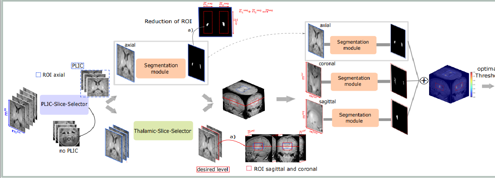

# Segmentation of posterior limb of internal capsule in preterm neonates

This repository contains the source code of the paper "A deep learning pipeline for the automated segmentation of posterior limb of internal
capsule in preterm neonates". In the following the steps of the framework are depicted.

